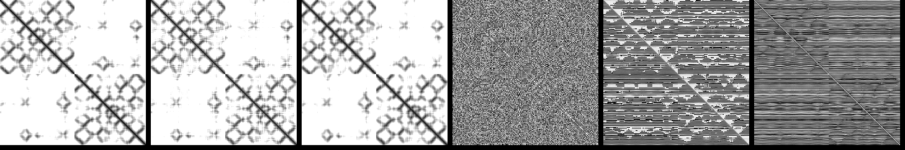

# deepab-pytorch

[](https://github.com/Lightning-AI/lightning)


An unofficial re-implementation of DeepAb, an interpretable deep learning model for antibody structure prediction.

## Installation

```bash
pip install deepab-pytorch
```

## Usage

**DeepAb model**
```python
import torch
from deepab_pytorch import DeepAb

antibody_lm_d_enc = 64
res1d_out_channel = 32
res1d_kernel_size = 17
res1d_n_blocks = 3
res2d_out_channel = 64
res2d_kernel_size = 5
res2d_n_blocks = 25
n_target_bins = 37

model = DeepAb(
  antibody_lm_d_enc=antibody_lm_d_enc,
  res1d_out_channel=res1d_out_channel,
  res1d_kernel_size=res1d_kernel_size,
  res1d_n_blocks=res1d_n_blocks,
  res2d_out_channel=res2d_out_channel,
  res2d_kernel_size=res2d_kernel_size,
  res2d_n_blocks=res2d_n_blocks,
  n_target_bins=n_target_bins
)

bsz, seq_len = 32, 256

# dummy input for antibody language model
# seq_len + 3 because of special tokens <sos>, <sep>, <eos>,
# each represents the start of heavy chain, light chain
# and the end of sequence, respectively.
seq_lm = torch.randint(0, 20, (bsz, seq_len + 3), dtype=torch.long)

SOS_TOKEN, SEP_TOKEN, EOS_TOKEN = 20, 21, 22
seq_lm[:, 0] = SOS_TOKEN
seq_lm[:, 128] = SEP_TOKEN
seq_lm[:, 254] = EOS_TOKEN

# dummy input for ResNet model
seq_onehot_resnet = torch.randn(bsz, 21, seq_len)

# forward pass through the model
out = model(seq_lm, seq_onehot_resnet)

# Six 2D matrices of shape (B, L, L, n_bins) are produced
n_target_bins = 37

assert len(out) == 6
for target in ['d_ca', 'd_cb', 'd_no', 'omega', 'theta', 'phi']:
    assert out[target].shape == (bsz, seq_len, seq_len, n_target_bins)
```

**Predicting unrelaxed antibody structure**
```bash
$ python -m deepab_pytorch.predict \
  --ckpt [CHECKPOINT_PATH] \
  --vh [VH_SEQ] \
  --vl [VL_SEQ] \
  --out-geometry output_geometry.pt \ # .pt file containing inter-residue geometry
  --out-pdb output.pdb
```
We get a coarse-grained structure prediction as below, which should be relaxed using Rosetta in the following step.

<p align="center"></p>

## Reproduction status

<p align="center"></p>

Training logs can be found [here](https://api.wandb.ai/links/dohlee/8y2ko0nn).

Predicted inter-residue geometries are visualized as follows.
Each of the six 2D matrices represents (1) distance between Ca atoms, (2) distance between Cb atoms, (3) distance between N-O atoms, (4) Ca-Cb-Cb'-Ca' dihedrals, (5) N-Ca-Cb-Cb' dihedrals, (6) planar angles between Ca-Cb-Cb' atoms, respectively.

**Target**


**See how prediction improves as training proceeds**


## Testing
```bash
pytest -vs --disable-warnings
```

## Citation
```bibtex
@article{ruffolo2022antibody,
  title={Antibody structure prediction using interpretable deep learning},
  author={Ruffolo, Jeffrey A and Sulam, Jeremias and Gray, Jeffrey J},
  journal={Patterns},
  volume={3},
  number={2},
  pages={100406},
  year={2022},
  publisher={Elsevier}
}
```
